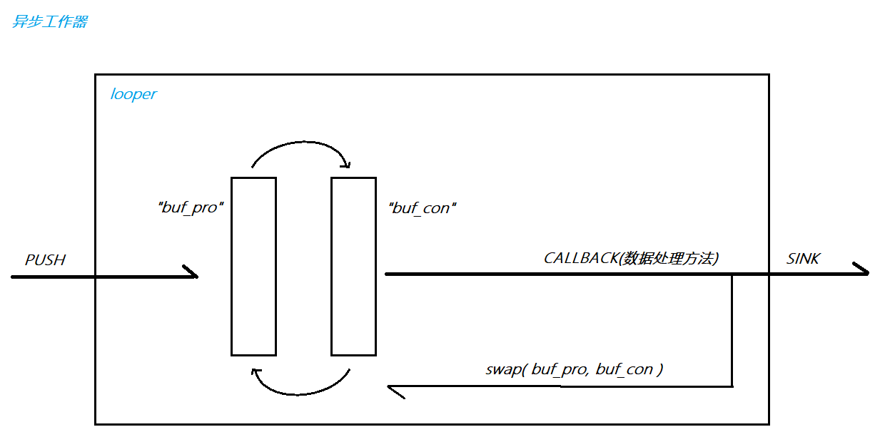

## Async&Sync Xlog

 ### 简介

Xlog是一个C++实现的日志库，支持同步和异步两种模式。

#### 特点:

- **高性能**

  异步模式采用了双缓冲区数据池的思想，极大地减少了锁冲突的概率，从而实现了高性能的日志输出。

- **使用灵活**

  缓冲区大小，日志格式，目录名称格式等都可以自定义设置.

- **功能全**

  Xlog还支持多级别的日志隔离，并提供了多种落地方式，如控制台输出、滚动文件等。

- **可扩展**

  采用工厂模式设计日志落地方式,可自定义扩展实际日志落地方式.

- **内存、线程安全**

  Xlog线程安全，支持多线程并发写入日志；内存安全上，全局使用智能指针管理动态资源，确保内存安全。


 #### 开发环境:

- 平台：centos7.9/ubuntu20.04.1
- 远程开发工具：vscode/powershell/XShell
- 编译工具：centos/g++7.3.1 ubuntu/g++9.4.0
- 调试工具：gdb
- 项目构建工具：makefile/CMake


 #### 技术特点:

 双缓冲数据池，设计模式（单例，工厂，建造者，代理），C/C++11，并发编程，类层次设计，⽣产消费模型


### 测试:

>  配置查看工具:lscpu

主要的测试⽅法是：每秒能打印⽇志数 = 打印⽇志条数 / 总的打印⽇志消耗时间  
主要测试要素：同步/异步 & 单线程/多线程   

1. 100w+条指定⻓度的⽇志输出所耗时间   
2. 每秒可以输出多少条⽇志  
3. 每秒可以输出多少MB⽇志     

测试工具位于bench目录下

- 测试环境1

|      操作系统:      |         centos7.9         |
| :-----------------: | :-----------------------: |
|    Architecture:    |          x86_64           |
|   CPU op-mode(s):   |      32-bit, 64-bit       |
|       CPU(s):       |             2             |
| Thread(s) per core: |             2             |
|     Model name:     | Intel(R) Xeon(R) Platinum |
|      CPU MHz:       |         2500.002          |
|     L1d cache:      |            32K            |
|     L1i cache:      |            32K            |
|      L2 cache:      |           1024K           |
|      L3 cache:      |          33792K           |


```
单线程测试:

--------------同步测试--------------
测试日志:1000000条, 线程数:1, 总大小:97912 KB, =95.385280M
        线程0耗时:2.4511s,平均:407979条/s
        总耗时:2.4511s
        每秒输出条数:407979
        每秒输出大小:39841MB
--------------异步测试--------------
测试日志:1000000条, 线程数:1, 总大小:97912 KB, =95.385280M
        线程0耗时:4.09723s,平均:244067条/s
        总耗时:4.09723s
        每秒输出条数:244067
        每秒输出大小:23834MB
		
多线程测试:		
		
--------------同步测试--------------
测试日志:1000000条, 线程数:2, 总大小:97912 KB, =95.385280M
        线程1耗时:1.83101s,平均:546145条/s
        线程0耗时:1.91826s,平均:521306条/s
        总耗时:1.91826s
        每秒输出条数:521306
        每秒输出大小:50908MB
--------------异步测试--------------
测试日志:1000000条, 线程数:2, 总大小:97912 KB, =95.385280M
        线程0耗时:1.93588s,平均:516559条/s
        线程1耗时:1.95372s,平均:511843条/s
        总耗时:1.95372s
        每秒输出条数:511843
        每秒输出大小:49984MB
```

​		


- 测试环境2


工具:lscpu

|操作系统: | ubuntu 20.04.1|
|:----|:----:|
|架构：                     |           x86_64|
|CPU 运行模式：              |          32-bit, 64-bit|
|CPU:                      |           16|
|在线 CPU 列表：            |           0-15|
|型号名称：                 |           AMD Ryzen 7 7840HS w/ Radeon 780M |Graphics								  |
|CPU MHz：                 |           3792.879|
|L1d 缓存：                 |           512 KiB|
|L1i 缓存：                 |           512 KiB|
|L2 缓存：                  |           16 MiB|
|L3 缓存：                  |           256 MiB|


```
单线程测试:

--------------同步测试--------------
测试日志:1000000条, 线程数:1, 总大小:97912 KB, =95.385280M
        线程0耗时:0.939156s,平均:1064786条/s
        总耗时:0.939156s
        每秒输出条数:1064786
        每秒输出大小:103983MB
--------------异步测试--------------
测试日志:1000000条, 线程数:1, 总大小:97912 KB, =95.385280M
        线程0耗时:1.40187s,平均:713334条/s
        总耗时:1.40187s
        每秒输出条数:713334
        每秒输出大小:69661MB
		

多线程测试:	

--------------同步测试--------------
测试日志:1000000条, 线程数:16, 总大小:97912 KB, =95.385280M
        线程11耗时:0.856884s,平均:1167019条/s
        线程15耗时:0.866436s,平均:1154152条/s
        线程12耗时:0.932631s,平均:1072234条/s
        线程7耗时:0.942179s,平均:1061369条/s
        线程10耗时:0.949563s,平均:1053116条/s
        线程9耗时:0.953762s,平均:1048479条/s
        线程4耗时:0.955364s,平均:1046721条/s
        线程3耗时:0.96429s,平均:1037032条/s
        线程1耗时:0.968526s,平均:1032497条/s
        线程5耗时:0.983133s,平均:1017156条/s
        线程14耗时:0.987258s,平均:1012906条/s
        线程2耗时:0.988721s,平均:1011408条/s
        线程13耗时:0.988073s,平均:1012070条/s
        线程6耗时:0.990163s,平均:1009934条/s
        线程0耗时:0.99065s,平均:1009438条/s
        线程8耗时:0.991553s,平均:1008519条/s
        总耗时:0.991553s
        每秒输出条数:1008519
        每秒输出大小:98488MB
--------------异步测试--------------
测试日志:1000000条, 线程数:16, 总大小:97912 KB, =95.385280M
        线程14耗时:0.396773s,平均:2520332条/s
        线程4耗时:0.405599s,平均:2465487条/s
        线程2耗时:0.408368s,平均:2448769条/s
        线程0耗时:0.415239s,平均:2408253条/s
        线程1耗时:0.416114s,平均:2403189条/s
        线程13耗时:0.416083s,平均:2403367条/s
        线程3耗时:0.417445s,平均:2395525条/s
        线程8耗时:0.420147s,平均:2380117条/s
        线程11耗时:0.422414s,平均:2367344条/s
        线程9耗时:0.424734s,平均:2354417条/s
        线程15耗时:0.42553s,平均:2350009条/s
        线程7耗时:0.437154s,平均:2287520条/s
        线程10耗时:0.439056s,平均:2277611条/s
        线程6耗时:0.442528s,平均:2259741条/s
        线程5耗时:0.444139s,平均:2251544条/s
        线程12耗时:0.445144s,平均:2246463条/s
        总耗时:0.445144s
        每秒输出条数:2246463
        每秒输出大小:219381MB


```

#### 性能分析:

  在单线程情况下，异步效率看起来没有同步高，这是意料之中的，因为现在的 I/O 操作在用户态都会有缓冲区进行缓冲，因此我们当前测试用例看起来的同步其实很多时候也是在操作内存，只有在缓冲区满了才会涉及到阻塞写磁盘操作。而异步单线程效率看起来低，也有一个很重要的原因就是单线程同步操作中不存在锁冲突，而单线程异步日志操作存在大量的锁冲突，因此性能也会有一定的降低。  

  另外，多线程情况下，同步打日志性能反而会有所降低，这是因为增加了线程对磁盘的读写争抢，即限制同步日志效率的最大原因是磁盘性能。而对于异步日志的限制，并非磁盘的性能，而是 CPU 的处理性能。打日志并不会因为落地而阻塞，因此在多线程打日志的情况下性能有了显著的提高。


### 快速使用


### 设计思路


